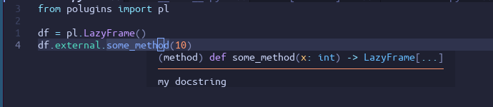
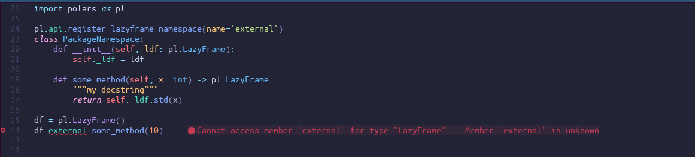

# Polugins

Minimal "plugin" system for polars.

With Polugins:



Without Polugins:



It's meant to solve two issues with using polars API extensions:

- You need to import the namespace to trigger the registration, even if you do not need anything from the namespace module.

- Extensions breaks static typing.

Polugins exposes some standard ways to use API extensions - both for your own and third party packages - 
and then use this discoverability to also generate type stubs with the added typing from the extensions.

Users can either call `register_namespaces` themselves or import polars through `polugins.polars`.
Lint rules can then be used to enforce that nothing is imported from polars outside of these locations.

Types are generated with the package `polugins_type_gen`. This creates static type stubs with the extensions added to them.

## Quick Start 

Say that you have a package `my_package` with a module like so:
```python
# namespaces.py
import polars as pl

class MyNamespace:
    def __init__(self, ldf: pl.LazyFrame):
        self._ldf = ldf

    def some_method(self, x: int) -> pl.LazyFrame:
        return self._ldf.std(x)
```

You also use an external package `example-package` that exposes a `LazyFrame` namespace called `external`.

in your `pyproject.toml` add a section:

```toml
[tool.polugins.lazyframe]
"my_namespace" = "my_package.namespaces:MyNamespace"
```

If you don't use `pyproject.toml` you can also create a file `polugins.toml` with this section.

After installing `polugins`, namespaces can be registered like so:

```python
from polugins import register_namespaces
import polars as pl

register_namespaces(
    load_entrypoints=True # Loads from example-package
    load_config=True # Loads from pyproject.toml and polugins.toml
  )

# Namespaces are now registered
(
  pl.LazyFrame()
  .external.some_method()
  .my_namespace.some_method()
)
```

You need to make sure that you have called `register_namespaces` before trying to use any of those namespaces.

As an alternative, polars is re-exported through `polugins` such that entrypoint, configuration and environment variable namespaces are automagically registered:

```python
from polugins import pl

# Namespaces are now registered
(
  pl.LazyFrame()
  .external.some_method()
  .my_namespace.some_method()
)
```

Since the registration is dynamic, your linter, typechecker and IDE will not know about these namespaces.
To solve this, install `polugins_type_gen` and then run `polugins stubs` from the root of you package. Type information is now generated and should be automatically picked up by your tools. 


## Usage

Namespaces can be registered in three ways:

- From a configuration file (`pyproject.toml` or `polugins.toml`)
- From entry points
- From environment variables

### Register from pyproject.toml or polugins.toml
In either your `pyproject.toml` or a file called `polugins.toml` put

```toml
[tool.polugins.<extension_class>]
"<namespace_name>" = "<path>:<class_name>"
```
Concrete example:

```toml
[tool.polugins.lazyframe]
"my_namespace" = "my_package.namespaces:MyNamespace"
```

Which will register a  `LazyFrame` namespace located at `my_package.namespaces` called `MyNamespace` as `my_namespace`.

### From entrypoint
If an installed packages exposes an namespace, they will automatically be picked up. See 
[Third party Package example](#third-party-package-example) for how to expose namespaces from packages


### From Env vars
Set an env var:
```bash
polugins_<extension_class>_<namespace_name>=<path>:<class_name>
```

Concrete example:

```bash
polugins_lazyframe_my_namespace=my_package.namespaces:MyNamespace
```

Which will register a  `LazyFrame` namespace located at `my_package.namespaces` called `MyNamespace` as `my_namespace`.

## Generate types

To generate types install the python package `polugins_type_gen` and then run `polugins stubs` to create type stubs at "./typings".

`polugins_type_gen` is only used as a CLI tool so it's recommended to put this in developer dependencies or installed with a tool like `pipx`.

## Third party Package example

Packages can expose namespace through entry points called `polugins.<class>`, for example `polugins.lazyframe`.

If building with poetry you should add this to your `pyproject.toml`:

```toml
[tool.poetry.plugins."polugins.<class>"]
"<accessor_name>" = "<path.to.module:NameSpace>"

# Concrete example:

[tool.poetry.plugins."polugins.lazyframe"]
"external" = "example_package:PackageNamespace"
```

See `tests/pkgs/example_package` for a example.

If using another tool than `poetry`, use their equivalent way of exposing endpoints.

Don't use the `pl.api.register_x` in your package. This will make the extension be registered on import which we specifically want to avoid.


## Implementation

Just a thin wrapper around `polars.api.register_x_namespace` and then using `importlib.metadata` to collect
namespaces from external packages.

Types are generated by using mypy to create stubs for lazyframe, dataframe, expr and series and then adding the
namespaces to these type stubs.

